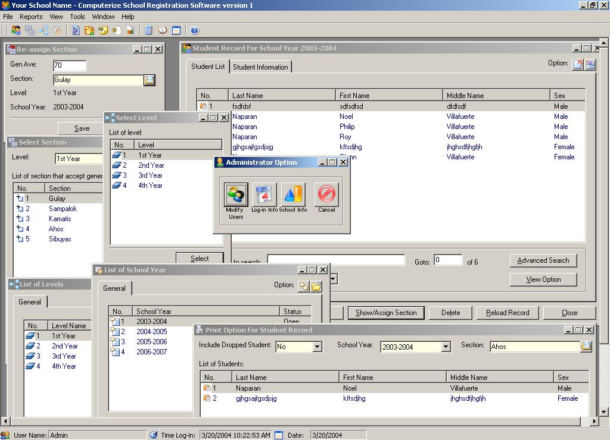



## \[\[\[\_\_CSRS version 1 / Using ADO\_\_\]\]\]

### Description

This is a complete Computerize School Registration Software which can be customize according to the name of the school. This software include record of users log-in and etc. The software also calculate how many student are curently enrolled and also update the allowed student per section every time you enrolled new student and it is similar to Inventory System ( download this to see more function ) . The application used ADO , String Manipulation , File System , Listview Control and etc ( see the include information for more ). For software like Accounting , Billing , POS ( Point Of Sales ), Account Recievable and etc. just log-on to www.naparansoft.cjb.net . This for all level of programmer . PLEASE DON'T FOR GET TO VOTE ! [ Philip V. Naparan ]
 
### More Info
 

             |
---                |---
**Submitted On**   |2004-03-21 20:16:52
**By**             |[Philip  V\. Naparan :\-\)](https://github.com/Planet-Source-Code/PSCIndex/blob/master/ByAuthor/philip-v-naparan.md)
**Level**          |Intermediate
**User Rating**    |4.8 (537 globes from 111 users)
**Compatibility**  |VB 3\.0, VB 4\.0 \(16\-bit\), VB 4\.0 \(32\-bit\), VB 5\.0, VB 6\.0, VB Script, ASP \(Active Server Pages\) , VBA MS Access, VBA MS Excel
**Category**       |[Complete Applications](https://github.com/Planet-Source-Code/PSCIndex/blob/master/ByCategory/complete-applications__1-27.md)
**World**          |[Visual Basic](https://github.com/Planet-Source-Code/PSCIndex/blob/master/ByWorld/visual-basic.md)
**Archive File**   |[\_\_\_\_CSRS\_v1723423232004\.zip](https://github.com/Planet-Source-Code/philip-v-naparan-csrs-version-1-using-ado__1-52497/archive/master.zip)

